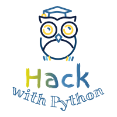

  

# Learn Python 3

## Introduction

This repository contains a collection of materials for teaching/learning Python 3 (3.5+).

#### Requirements
* Use [Google Colab](https://colab.research.google.com/notebooks/intro.ipynb) Notebooks to follow codidng examples.

If you can not access Google Colab Notebook, you can still follow the web based materials. However, you should be able to use Colab Notebook in order to complete the exercises.

#### Usage

1. Clone or download this repository onto your Google Drive.
2. Open Google colab notebooks on Google Dirve via Chrome browser.
3. Google Colab session will open in the browser and you can start navigating through the materials.

#### Contributing
See [contributing](https://github.com/jerry-git/learn-python3/blob/master/CONTRIBUTING.md) guide.

### The Zen Of Python

`import this`

*The Zen of Python, by Tim Peters*

* Beautiful is better than ugly.
* Explicit is better than implicit.
* Simple is better than complex.
* Complex is better than complicated.
* Flat is better than nested.
* Sparse is better than dense.
* Readability counts.
* Special cases aren't special enough to break the rules.
* Although practicality beats purity.
* Errors should never pass silently.
* Unless explicitly silenced.
* In the face of ambiguity, refuse the temptation to guess.
* There should be one-- and preferably only one --obvious way to do it.
* Although that way may not be obvious at first unless you're Dutch.
* Now is better than never.
* Although never is often better than *right* now.
* If the implementation is hard to explain, it's a bad idea.
* If the implementation is easy to explain, it may be a good idea.
* Namespaces are one honking great idea -- let's do more of those!

## Beginner
1. [Strings](https://jerry-git.github.io/learn-python3/notebooks/beginner/html/strings.html) [[notebook]](http://nbviewer.jupyter.org/github/jerry-git/learn-python3/blob/master/notebooks/beginner/notebooks/strings.ipynb) [[exercise]](http://nbviewer.jupyter.org/github/jerry-git/learn-python3/blob/master/notebooks/beginner/exercises/strings_exercise.ipynb)
1. [Numbers](https://jerry-git.github.io/learn-python3/notebooks/beginner/html/numbers.html) [[notebook]](http://nbviewer.jupyter.org/github/jerry-git/learn-python3/blob/master/notebooks/beginner/notebooks/numbers.ipynb) [[exercise]](http://nbviewer.jupyter.org/github/jerry-git/learn-python3/blob/master/notebooks/beginner/exercises/numbers_exercise.ipynb)
1. [Conditionals](https://jerry-git.github.io/learn-python3/notebooks/beginner/html/conditionals.html) [[notebook]](http://nbviewer.jupyter.org/github/jerry-git/learn-python3/blob/master/notebooks/beginner/notebooks/conditionals.ipynb) [[exercise]](http://nbviewer.jupyter.org/github/jerry-git/learn-python3/blob/master/notebooks/beginner/exercises/conditionals_exercise.ipynb)
1. [Lists](https://jerry-git.github.io/learn-python3/notebooks/beginner/html/lists.html) [[notebook]](http://nbviewer.jupyter.org/github/jerry-git/learn-python3/blob/master/notebooks/beginner/notebooks/lists.ipynb) [[exercise]](http://nbviewer.jupyter.org/github/jerry-git/learn-python3/blob/master/notebooks/beginner/exercises/lists_exercise.ipynb)
1. [Dictionaries](https://jerry-git.github.io/learn-python3/notebooks/beginner/html/dictionaries.html) [[notebook]](http://nbviewer.jupyter.org/github/jerry-git/learn-python3/blob/master/notebooks/beginner/notebooks/dictionaries.ipynb) [[exercise]](http://nbviewer.jupyter.org/github/jerry-git/learn-python3/blob/master/notebooks/beginner/exercises/dictionaries_exercise.ipynb)
1. [For loops](https://jerry-git.github.io/learn-python3/notebooks/beginner/html/for_loops.html) [[notebook]](http://nbviewer.jupyter.org/github/jerry-git/learn-python3/blob/master/notebooks/beginner/notebooks/for_loops.ipynb) [[exercise]](http://nbviewer.jupyter.org/github/jerry-git/learn-python3/blob/master/notebooks/beginner/exercises/for_loops_exercise.ipynb)
1. [Functions](https://jerry-git.github.io/learn-python3/notebooks/beginner/html/functions.html) [[notebook]](http://nbviewer.jupyter.org/github/jerry-git/learn-python3/blob/master/notebooks/beginner/notebooks/functions.ipynb) [[exercise]](http://nbviewer.jupyter.org/github/jerry-git/learn-python3/blob/master/notebooks/beginner/exercises/functions_exercise.ipynb)
1. [Testing with pytest - part 1](https://jerry-git.github.io/learn-python3/notebooks/beginner/html/testing1.html) [[notebook]](http://nbviewer.jupyter.org/github/jerry-git/learn-python3/blob/master/notebooks/beginner/notebooks/testing1.ipynb) [[exercise]](http://nbviewer.jupyter.org/github/jerry-git/learn-python3/blob/master/notebooks/beginner/exercises/testing1_exercise.ipynb)
1. Recap exercise 1 [[exercise]](http://nbviewer.jupyter.org/github/jerry-git/learn-python3/blob/master/notebooks/beginner/exercises/recap1_exercise.ipynb)
1. [File I\O](https://jerry-git.github.io/learn-python3/notebooks/beginner/html/file_io.html) [[notebook]](http://nbviewer.jupyter.org/github/jerry-git/learn-python3/blob/master/notebooks/beginner/notebooks/file_io.ipynb) [[exercise]](http://nbviewer.jupyter.org/github/jerry-git/learn-python3/blob/master/notebooks/beginner/exercises/file_io_exercise.ipynb)
1. [Classes](https://jerry-git.github.io/learn-python3/notebooks/beginner/html/classes.html) [[notebook]](http://nbviewer.jupyter.org/github/jerry-git/learn-python3/blob/master/notebooks/beginner/notebooks/classes.ipynb) [[exercise]](http://nbviewer.jupyter.org/github/jerry-git/learn-python3/blob/master/notebooks/beginner/exercises/classes_exercise.ipynb)
1. [Exceptions](https://jerry-git.github.io/learn-python3/notebooks/beginner/html/exceptions.html) [[notebook]](http://nbviewer.jupyter.org/github/jerry-git/learn-python3/blob/master/notebooks/beginner/notebooks/exceptions.ipynb) [[exercise]](http://nbviewer.jupyter.org/github/jerry-git/learn-python3/blob/master/notebooks/beginner/exercises/exceptions_exercise.ipynb)
1. [Modules and packages](https://jerry-git.github.io/learn-python3/notebooks/beginner/html/modules_and_packages.html) [[notebook]](http://nbviewer.jupyter.org/github/jerry-git/learn-python3/blob/master/notebooks/beginner/notebooks/modules_and_packages.ipynb)
1. [Debugging](https://jerry-git.github.io/learn-python3/notebooks/beginner/html/debugging.html) [[notebook]](http://nbviewer.jupyter.org/github/jerry-git/learn-python3/blob/master/notebooks/beginner/notebooks/debugging.ipynb) [[exercise]](http://nbviewer.jupyter.org/github/jerry-git/learn-python3/blob/master/notebooks/beginner/exercises/debugging_exercise.ipynb)
1. [Goodies of the Standard Library - part 1](https://jerry-git.github.io/learn-python3/notebooks/beginner/html/std_lib.html) [[notebook]](http://nbviewer.jupyter.org/github/jerry-git/learn-python3/blob/master/notebooks/beginner/notebooks/std_lib.ipynb) [[exercise]](http://nbviewer.jupyter.org/github/jerry-git/learn-python3/blob/master/notebooks/beginner/exercises/std_lib1_exercise.ipynb)
1. [Testing with pytest - part 2](https://jerry-git.github.io/learn-python3/notebooks/beginner/html/testing2.html) [[notebook]](http://nbviewer.jupyter.org/github/jerry-git/learn-python3/blob/master/notebooks/beginner/notebooks/testing2.ipynb) [[exercise]](http://nbviewer.jupyter.org/github/jerry-git/learn-python3/blob/master/notebooks/beginner/exercises/testing2_exercise.ipynb)
1. [Virtual environment](https://jerry-git.github.io/learn-python3/notebooks/beginner/html/venv.html) [[notebook]](http://nbviewer.jupyter.org/github/jerry-git/learn-python3/blob/master/notebooks/beginner/notebooks/venv.ipynb)
1. [Project structure](https://jerry-git.github.io/learn-python3/notebooks/beginner/html/project_structure.html) [[notebook]](http://nbviewer.jupyter.org/github/jerry-git/learn-python3/blob/master/notebooks/beginner/notebooks/project_structure.ipynb)
1. Recap exercise 2 [[exercise]](http://nbviewer.jupyter.org/github/jerry-git/learn-python3/blob/master/notebooks/beginner/exercises/recap2_exercise.ipynb)

## Intermediate

#### Idiomatic Python
Python is a powerful language which contains many features not presented in most other programming languages. Idiomatic section will cover some of these Pythonic features in detail. These materials are especially useful for people with background in other programming languages.

1. [Idiomatic loops](https://jerry-git.github.io/learn-python3/notebooks/intermediate/html/idiomatic_loops.html) [[notebook]](http://nbviewer.jupyter.org/github/jerry-git/learn-python3/blob/master/notebooks/intermediate/notebooks/idiomatic_loops.ipynb)
1. [Idiomatic dictionaries](https://jerry-git.github.io/learn-python3/notebooks/intermediate/html/idiomatic_dicts.html) [[notebook]](http://nbviewer.jupyter.org/github/jerry-git/learn-python3/blob/master/notebooks/intermediate/notebooks/idiomatic_dicts.ipynb)
1. [Idiomatic Python - miscellaneous part 1](https://jerry-git.github.io/learn-python3/notebooks/intermediate/html/idiomatic_misc1.html) [[notebook]](http://nbviewer.jupyter.org/github/jerry-git/learn-python3/blob/master/notebooks/intermediate/notebooks/idiomatic_misc1.ipynb)
1. [Idiomatic Python - miscellaneous part 2](https://jerry-git.github.io/learn-python3/notebooks/intermediate/html/idiomatic_misc2.html) [[notebook]](http://nbviewer.jupyter.org/github/jerry-git/learn-python3/blob/master/notebooks/intermediate/notebooks/idiomatic_misc2.ipynb)
1. Idiomatic Python exercise [[exercise]](http://nbviewer.jupyter.org/github/jerry-git/learn-python3/blob/master/notebooks/intermediate/exercises/idiomatic_python_exercise.ipynb)

#### Step up your `pytest` game
1. [Efficient use of fixtures](https://jerry-git.github.io/learn-python3/notebooks/intermediate/html/pytest_fixtures.html) [[notebook]](http://nbviewer.jupyter.org/github/jerry-git/learn-python3/blob/master/notebooks/intermediate/notebooks/pytest_fixtures.ipynb)
1. Other tips and tricks

#### Best practices
A list of best development practices for Python projects. Most of the practices listed here are also applicable for other languages, however the presented tooling focuses mainly on Python.
1. [Best practices](https://jerry-git.github.io/learn-python3/notebooks/intermediate/html/best_practices.html) [[notebook]](http://nbviewer.jupyter.org/github/jerry-git/learn-python3/blob/master/notebooks/intermediate/notebooks/best_practices.ipynb)

#### General topics
1. [Goodies of the Standard Library - part 2](https://jerry-git.github.io/learn-python3/notebooks/intermediate/html/std_lib2.html) [[notebook]](http://nbviewer.jupyter.org/github/jerry-git/learn-python3/blob/master/notebooks/intermediate/notebooks/std_lib2.ipynb) [[exercise]](http://nbviewer.jupyter.org/github/jerry-git/learn-python3/blob/master/notebooks/intermediate/exercises/std_lib2_exercise.ipynb)

#### Backlog
* Sets
* Generators
* Decorators
* Context managers
* Playing with attributes
* *, *args, **kwargs
* Command line arguments with click
* OOP - inheritance
* OOP - Abstract Base Classes
* OOP - attrs
* Testing with mocks
* Structuring your tests

## Use cases

#### Playing with the web
* requests
* testing requests with responses
* beautifulsoup4
* selenium

#### Communicating with databases
* SQLAlchemy

#### Working with documents
* excel
	* openpyxl
* pdf
	* pdfrw / PyPDF2

## Credits
* Logo: Abdur-Rahmaan Janhangeer, [@Abdur-rahmaanJ](https://github.com/Abdur-rahmaanJ)
